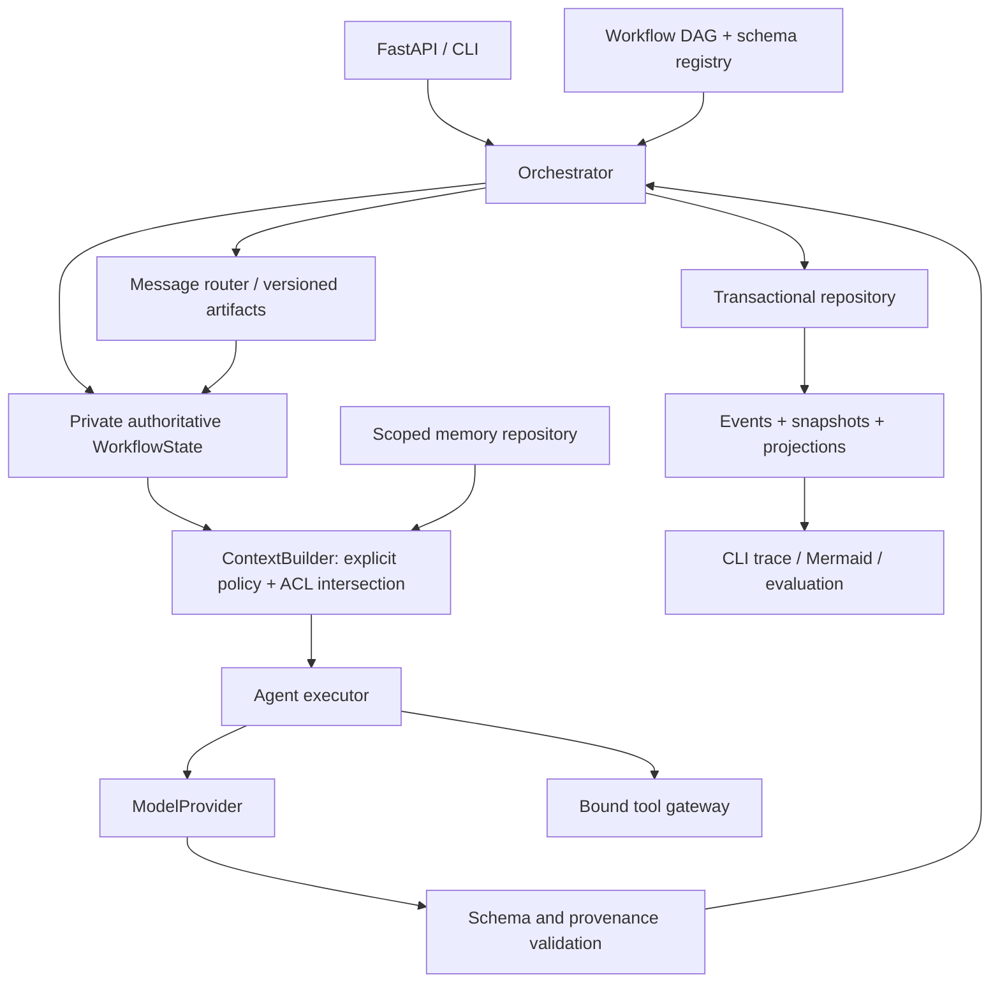

# Architecture

## Design before implementation

The authoritative state belongs to a single orchestrator per run. Workers receive
serialized, detached AgentContext values and a bound tool gateway. They never
receive WorkflowState, repository handles, other agents, or the memory store.

## Domain model

AgentDefinition references registered input/output schemas and owns context,
tool, model, retry, timeout, execution and visibility policies. AgentContext
contains an explicit task, selected inputs, selected untrusted knowledge,
authorized artifacts/messages, scoped memories and tool results. AgentResult
contains validated output, uncertainty, usage and safe error codes.

Artifact is an immutable versioned publication with producer and reader ACL.
MessageEnvelope contains validated artifact references and explicit recipients;
raw private contexts cannot be routed. WorkflowState contains node states,
artifacts, messages, agent runs, initial input and approval decisions. Run pins a
complete workflow and agent-definition snapshot so resume does not silently pick
up a changed configuration. Event has monotonically increasing per-run sequence,
timestamp, type and metadata without document or prompt content.

## Execution

Validate the DAG and all schema/policy references before starting. Schedule ready
nodes in bounded parallel batches. Every worker in a batch sees the same committed
snapshot. Commit completed workers in deterministic node order. Edge conditions
inspect structured output; joins choose all or any activated predecessors and
may explicitly tolerate failed dependencies. An inactive branch propagates skip.
Default failures block descendants but independent branches complete. Final run
status distinguishes completion, partial success, failure, pause and cancellation.

Agent lifecycle: scheduled → context built → running → result validated →
artifact published → message routed → state committed. Retry only transient
provider failures and malformed output, within a bounded attempt and timeout
budget. Tool access violations are permanent. Tool calls are bounded and are
rejected before invocation when permission or arguments are invalid.

Approval nodes pause only after other ready work has committed. Decisions are
persisted before resume; rejection skips the approval branch. Cancellation
cancels active asyncio tasks and persists a terminal run state. Interrupted runs
can resume from the last committed batch; external model/tool calls have
at-least-once semantics. Tools should be read-only or idempotent.

## Persistence and replay

An async Repository protocol separates the runtime from SQLAlchemy. SQLite is
the local default; PostgreSQL uses the same schema and async transaction logic.
Each checkpoint atomically stores the current run, append-only events, immutable
state snapshot and materialized agent-run/artifact/message/usage records. A
revision compare-and-swap rejects stale writers. v1 is single-process scheduling;
CAS is corruption protection, not a distributed work lease.

SQLite connection scopes are serialized within a repository instance because an
in-memory engine shares one physical connection; concurrent logical transactions
must not interfere. PostgreSQL uses independent connections and compare-and-swap
updates. Event sequence follows deterministic commit order while worker timestamps
preserve actual occurrence time. Cancellation retains known attempt usage and
worker records, including successes completed before the cancellation.

Replay reconstructs a committed state from its snapshot and exposes ordered
events. It does not rerun nondeterministic models or promise event-only rebuilds;
events intentionally omit sensitive payloads. Long-term memory is explicitly
written via a trusted operator interface and namespaced by agent; no automatic
cross-run promotion of model text.

## Extension boundaries and limits

New apps register schemas, agents, policies and DAGs. Providers implement one
async protocol. Tools validate typed inputs/outputs. Storage implements the
repository and memory interfaces. A future simulation stage can be a typed DAG
node publishing predicted-state artifacts; no unused simulator hierarchy exists.

Policy enforcement cannot prevent a model independently guessing a secret or
following instructions in text. It prevents inaccessible content being supplied
and unauthorized tool effects. Generated artifacts are explicit declassification
boundaries configured by workflow authors, with evidence scope checked at runtime.

## Primary implementation references

- [SQLAlchemy asyncio: session per concurrent task](https://docs.sqlalchemy.org/en/20/orm/extensions/asyncio.html)
- [Pydantic model validation](https://docs.pydantic.dev/latest/concepts/models/)
- [FastAPI lifespan](https://fastapi.tiangolo.com/advanced/events/)
