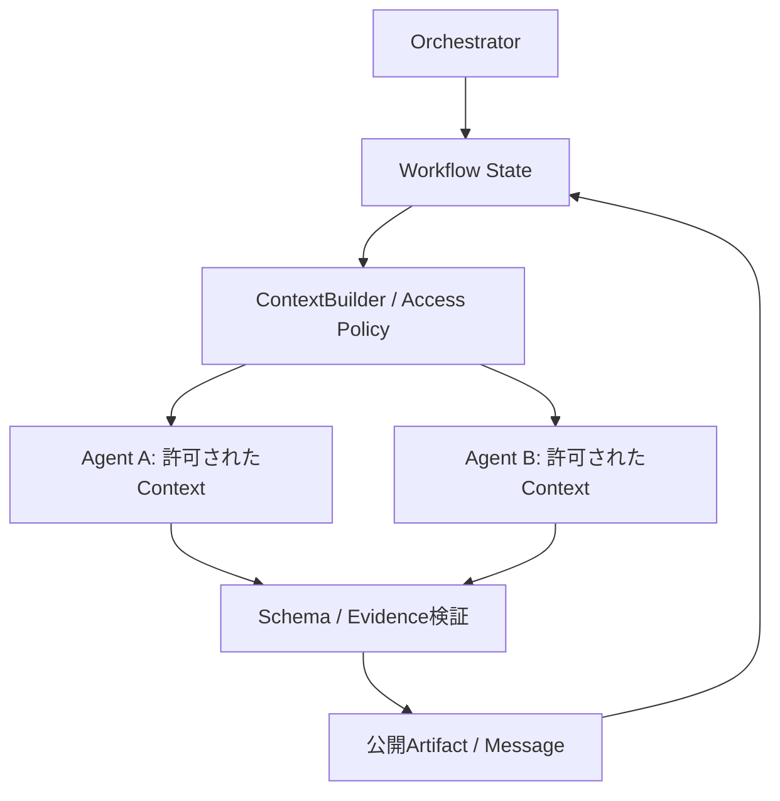

> 本稿は2026年9月30日時点の開発記録をもとにした前編です。Runtimeの実装、研究基盤づくり、Mac上のローカルOllamaによる実モデルPilotまでを扱います。Windows / NVIDIAでの実機検証は別環境で進めるため、後編に分けます。実モデルPilotはまだ完走しておらず、Role DiversityとEpistemic Diversityの優劣について結論は出ていません。

## 出発点は「役名を変えれば別のエージェントなのか」という疑問だった

Multi-Agentの説明では、よくこんな構成を見かけます。

```text
同じモデル + 同じ情報
    ├── 分析担当
    ├── 批判担当
    └── まとめ担当
```

これは有効な設計かもしれません。観点を変えて考えさせたり、生成と評価を分離したりする意味はあります。

ただ、ここで疑問がありました。

**役名やsystem promptが違うだけで、本当に異なる認識を持った主体になっているのだろうか。**

人間の会議を例えにすると分かりやすいと思います。参加者は、それぞれ経験、知識、価値観、見ている現場が違います。その違いを持ち寄ることで、一人では気づかなかったことが見えてくる場合があります。

一方、同じモデルに同じ情報を渡して役割だけ変える構成は、同じ認識基盤から複数の回答を作っている、と見ることもできます。もちろん、それだけで無意味だと言いたいわけではありません。気になったのは、「役割の違い」と「アクセスできる情報の違い」が混同されていることでした。

そこで、今回のプロジェクトでは、エージェントを分けることを、名前ではなく**情報・権限・責務の境界を分けること**として実装することにしました。

なお、同じ基盤モデルを使う限り、事前学習された知識まで別物になるわけではありません。本稿で扱う情報の違いは、主に実行時に参照できるタスク固有のEvidenceの違いです。人間の信条や人格を再現する話ではありません。

## 作りたかったのは、Multi-AgentアプリではなくRuntimeだった

特定の調査アプリだけを作るなら、その用途に合わせてLLM呼び出しを並べる方法もあります。

今回は、その下にある基盤を作ることを目標にしました。

エージェントごとに、Context、Memory、Knowledge access、Tool permissions、入出力Schema、Model configuration、実行・再試行・timeoutの方針、公開範囲を独立して定義できるRuntimeです。

過去の開発経験から得た一般的な知見は出発点にしていますが、以前のコード、プロンプト、企業固有情報、内部資料は使っていません。公開可能な独立した作品として、Codexと対話しながら設計・実装・検証を進めました。

最初に要求を整理し、architecture documentとADRを書いてから実装しました。ADRは、単に「何を使ったか」ではなく、「なぜこの境界を置いたか」を後から説明するための記録です。

v1では既存のMulti-Agent frameworkをCoreに使っていません。frameworkが悪いという意味ではなく、今回はRuntimeそのものを理解し、設計判断を説明できることが目的だったためです。

主な構成はPython、asyncio、Pydantic、FastAPI、SQLAlchemyです。ローカル保存にはSQLite、別の保存先としてPostgreSQLを扱えるようにしました。早期のMicroservices化やVector DB導入、World Modelの実装は避けています。

## 最も重要な境界は、Global StateからAgent Contextを作るところ

設計の中心は、エージェントへGlobal Stateをそのまま渡さないことです。



権威あるStateはOrchestratorが管理します。ContextBuilderがPolicyとアクセス権を適用し、それぞれのエージェントに渡す情報を選びます。

エージェントの実行側には、Global StateやRepository、他エージェント、Memory storeへの参照を渡しません。渡すのは切り離されたContextと、そのエージェントに束縛されたTool gatewayです。可変データの共有による意図しない変更も避けます。

例えば調査担当AにEvidence Aだけを割り当てたなら、担当BのEvidenceやprivate memoryはContextに入りません。

ここで大切なのは、「見ないでください」というプロンプトではなく、**そもそも送らないこと**です。

Toolも同様です。許可されていないToolへの呼び出しは実行前に拒否します。ただし、Tool名の許可だけでファイルやネットワークのアクセス先まで安全になるわけではありません。そうしたToolを追加する場合は、trusted handler側で対象リソースの範囲を検証する必要があります。

### 情報分離にも、保証できる範囲がある

この実装は、Pythonプロセス内の情報と能力の境界です。悪意あるPython拡張を隔離するOSレベルのsandboxではありません。

また、モデルが偶然秘密を推測することや、許可された文章から意味的に情報を漏らすことまで完全に防げるわけではありません。

「Promptで禁止するより強い」ことと、「あらゆる攻撃に安全」なことは別です。ここはポートフォリオでも、強く見せるより保証範囲を明確にしたい部分でした。

## 会話履歴ではなく、Stateと公開成果物を中心にした

エージェント同士の自由なチャットを中心にはしていません。

モデルの出力をPydanticで検証し、成果物をversion付きArtifactとして公開します。Messageには明示的な宛先と参照を持たせます。次のエージェントは、公開されたArtifactを受け取るのであって、前のエージェントの内部Contextを丸ごと受け取るわけではありません。

```text
private evidence
      ↓
workerの分析
      ↓
公開するstructured artifact
      ↓
reviewer / synthesizer
```

公開は、意図的に情報を渡す境界です。元のContextを隠したまま、分析結果の共有は許可する。この二つを区別しました。

WorkflowはNode、Edge、Conditionを持つDAGとして表現します。順次実行、並列実行、分岐、join、human approval、失敗時の依存関係を明示します。

Runtimeは独立したbranchを継続でき、join側が部分結果を許容するかも定義できます。ただし、後述する研究Pilotでは、実験Protocolがoperational failure時の停止を要求しています。**Runtimeが継続できることと、研究で継続してよいことは別**です。

実行の重要な操作はEventとして記録します。Contextに含まれたカテゴリ、ArtifactやMessageの流れ、Model、attempt、usage、latency、errorをCLIから確認できます。Mermaid形式の情報フローも出せます。

Replayについても、過大に言わないようにしました。保存したsnapshotからコミット済みStateを復元し、Eventを追える構造です。非決定的なLLMを同じように再実行することや、機密payloadを省いたEventだけから全Stateを再構築することは保証していません。

保存するのは明示的な判断、根拠、要約です。hidden chain-of-thoughtは保存しません。

## 同じRuntimeを、二つの用途で使ってみた

Runtimeの再利用性を確認するために、二つのDemoを載せました。

一つ目はDistributed Investigationです。Evidenceを複数の調査担当へ分割し、Reviewer、Conflict Detector、Synthesizerへstructured findingsを渡します。後段にはraw evidenceを直接見せず、公開された成果物を扱わせます。

二つ目はSoftware Change Reviewです。Architecture、Security、Test、Maintainabilityの担当が、異なる入力を受け取ります。Final Reviewerは各担当のfindingsをまとめますが、元のコードやテストなどの内部Contextには直接アクセスしません。

この二つで示したかったのは、専門家の役名を増やすことではありません。

**同じRuntime上で、情報と責務の分け方を用途ごとに変えられること**です。

## 「情報を分ければ良くなるのか」は、実装だけでは答えられない

情報境界をコードで実現できても、それがタスク性能を改善するとは限りません。

情報を分割すれば、各担当が扱う量は減ります。一方、局所情報だけでは誤解が起きたり、Synthesizerが必要な前提を取り戻せなかったりする可能性もあります。

そこで、Runtimeとは別に研究基盤を作りました。

Research Questionは、次の問いです。

> How does epistemic diversity created by information separation compare with prompt-level role diversity in LLM multi-agent systems?

つまり、Role Promptによる多様性と、実際にアクセスできる情報を分けた多様性は、どう違うのか。

研究コードは`experiments/epistemic-diversity/`に置き、依存方向を`experiments → app`にしました。Runtime本体へ特定の研究条件を混ぜないためです。

### Roleと情報分離を、別々に操作する

比較条件は五つです。

| 条件 | Worker | Role | Evidence |
| --- | --- | --- | --- |
| C0 | 1 Agent | 共通の基本指示 | 全Evidence |
| C1 | 3 Workers + Synthesizer | 同じRole | 全員が全Evidence |
| C2 | 3 Workers + Synthesizer | Analytical / Skeptical / Systems | 全員が全Evidence |
| C3 | 3 Workers + Synthesizer | 同じRole | Workerごとに分割 |
| C4 | 3 Workers + Synthesizer | 三つのRole | Workerごとに分割 |

C1は「Agentを増やしただけ」のcontrolです。C2とC3が中心比較で、C4は組み合わせの効果を見る条件です。

C1〜C4では、Synthesizerへ渡すのはWorkerが公開したstructured artifactsだけです。raw private contextを後段へ渡してしまうと、情報分離の設計が比較の途中で崩れてしまいます。

C4ではRoleとEvidence partitionの相性が結果に混ざらないよう、taskとseedに応じて割り当てを再現可能にrandomizeします。

同じモデル、生成設定、Schema、Worker数などをできるだけ揃えます。それでもC0とMulti-Agentでは呼び出し数も総token量も違います。その差を消したことにするのではなく、資源使用量と一緒に報告する方針です。

## Benchmarkを増やすより、問題の構造を増やしたかった

最初のBenchmarkは24 tasksでした。ただし、六つのtemplate familyから作られており、task数ほど独立した問題構造があるわけではありませんでした。

文章だけを変えた問題を増やしても、多様な状況を検証したことにはなりません。

そこでBenchmark 2.0.0では、十family、各easy / medium / hardの三例、合計30 tasksにしました。

| Family | 統合しなければならないもの |
| --- | --- |
| Distributed synthesis | 相補的な観測と複数の支持経路 |
| Root cause diagnosis | 症状、介入、対照条件 |
| Constraint satisfaction | 必須制約、予算、候補の適合性 |
| Contradiction resolution | 時点、適用範囲、条件、信頼性 |
| Missing information | 判断に必要だが存在しない情報 |
| Sequential causal reasoning | 中間状態と伝播を止める条件 |
| Multi-perspective decision | 複数基準と非補償的な拒否条件 |
| Failure analysis | 起点、増幅要因、防御、結果 |
| Planning under constraints | 前提、実行順序、join、rollback |
| Evidence ranking | 独立性、適用範囲、介入の強さ |

ただし、十種類の完全に異なる推論体系を実装したわけではありません。監査可能な小さな公開rule表現を共有しており、構造的な多様性にも限界があります。難易度も実モデルの正答率で校正したものではなく、依存関係などに基づく事前の分類です。

Goldはruntime inputと分離しました。Agentへ正解、hidden annotation、distractorのラベルを渡さないことをテストします。Evidence partitionでは関連情報やdistractorの偏りも検査します。

なお、分割はGold側の関連性や重要度を使ってバランスを取るoracle-assistedな方法です。現実の検索や担当割り振りの難しさまで再現しているわけではありません。

### Gold漏洩だけ見ていれば十分ではなかった

実モデル実験前の監査で、正しいdecision candidateが常に先頭に置かれている問題が見つかりました。

Goldを直接送っていなくても、候補の順序が手掛かりになる可能性があります。

これに対し、Goldを参照しないtask / seed由来のshuffleを全条件共通で適用しました。以前のsource、seal、Mock結果は保存し、新しいProtocolとして記録しています。

「秘密の正解フィールドが入っていない」ことと、「分布上の答えのヒントがない」ことは別でした。これはBenchmark監査で重要な気づきでした。

## 多様性は、文章の違いではなく有効な貢献で測る

三人が違う言い回しをしていても、同じEvidenceを使い、同じことを言っているだけかもしれません。

そのため、Primary diversity metricsはEvidence、valid gold fact、required insightの集合を基準にしました。

例えばUseful Unique Contributionは、Worker群が回収した有効項目のうち、一人だけが貢献した項目の割合です。間違った主張や根拠のない新奇な文章は、貢献として数えません。

Redundancyも、文章の見た目ではなく、それらの有効集合の重複で測ります。

Collective Coverage Gainは次の差です。

```text
全Workerを合わせたcoverage
    − 最もcoverageが高い単独Workerのcoverage
```

これは情報を持ち寄る効果を捉えます。ただし、分割しただけで機械的に上がる可能性もあり、創造性や最終回答の優秀さそのものではありません。

Marginal Contributionも実装しましたが、ここは特に名前に注意しました。観測された最終回答を固定したまま、一人分の公開provenanceを外すと、支持できるGold factがどれだけ減るかを見るproxyです。Agentを除いてLLMに最終回答を再生成させた反実仮想実験ではありません。

最終回答のGold coverage、Workerのrelevant evidence coverage、task success、unsupported claims、contradictions、leakage、token usage、latencyなども記録します。

閉じたGold annotationによる評価なので、正しくても未annotationの主張がunsupported扱いになる限界があります。literalなIDやcanaryの検査でleakageが0でも、あらゆる意味的漏洩がないという証明にはなりません。

統計処理はpaired comparisonを中心にし、Benchmark v2では同じfamilyのtaskを独立な標本として水増ししないようfamily単位で集約します。Bootstrap intervalなども用意しましたが、小さなPilotで強い一般化はできません。

## Mockの成功は、LLMの成功ではなかった

Mock Providerで、Workflow、情報分離、Metric、保存、集計、Figure生成のpipelineを検証しました。

初期BenchmarkではPilot 10 runs / 34 calls、Full 240 runs / 816 callsを実行しました。Benchmark v2のProtocol 2.1ではPilot 12 runs / 48 calls、Full 150 runs / 510 callsを実行しています。いずれもMockです。

決定的なMockでは、最終task成績が全条件で同じでした。情報分離条件ではEvidence利用の重複が減り、検査したliteral leakageも0でした。

ここで言えるのは、実験pipelineが意図した条件を実行できることです。**Epistemic Diversityが実LLMで有効だという証拠でも、差がないという証拠でもありません。**

むしろ、Mockで通ることと実モデルで完走することの間には、大きな距離がありました。

## 実モデルPilotは、別々の理由で止まり続けた

実モデルには、MacBook Air上のローカルOllamaと`qwen3:14b`を使いました。

正式Pilotは六つの固定taskをC2 / C3で一回ずつ実行する計画です。一つのrunは、三Workerと一Synthesizerの最大四callsなので、全体で12 runs / 48 callsを予定していました。

Protocolをfreezeし、Model、endpoint、設定、campaignをbindingへ記録してから実行します。operational failureが起きたら停止し、研究成績の比較へ進まない方針です。

結果は、次のようになりました。

| Protocol | 主な設定・修正 | 実際の停止 |
| --- | --- | --- |
| 2.1 | 初期の並列実行、90秒deadline | 1 run / 3 calls。timeoutとCancelledError |
| 2.2 | Worker / Model concurrency 1 / 1、300秒 | 4 runs / 16 calls。C3 Synthesizerがtimeout |
| 2.3 | 600秒、Ollamaへ`max_tokens=2048`を送信 | 5 runs / 19 calls。Workerのlength termination |
| 2.4 | 1200秒、`max_tokens=4096`、観測改善 | 4 runs / 15 Pilot calls。無効なEvidence IDを拒否 |

2.4の15 callsとは別に、直前の診断で3 callsを使っています。研究Pilotとengineering diagnosticは区別して記録しています。

これらを「同じ失敗を何度もした」とまとめると、改善すべき場所を見失います。

### 1. timeout――入力が長いから、とは言い切れなかった

Protocol 2.2では、`v2-diagnosis-medium / C3`の三Workerは成功しましたが、Synthesizerが約300.01秒でtimeoutしました。

同じtaskのC2 Synthesizerは、serialized contextが約5729文字で約170.10秒。C3は約5105文字でtimeoutです。

少なくとも「C3は入力文字数が多かったから遅い」という説明には合いません。ただし、文字数はtoken数でも完全なHTTP payloadサイズでもありません。失敗callの応答も残っていなかったため、その記録だけで内部の遅延要因を確定できませんでした。

並列から逐次に変えたのは、ローカルbackendとの実行上の整合を取るためです。Workerは互いの出力を入力にしないので、逐次化しても情報共有を追加したことにはなりません。ただし、latencyや負荷、完走確率には影響するため、異なるProtocolの結果は混ぜません。

### 2. token limit――設定値と、実際のrequestは違う

Providerは当初、`max_completion_tokens=2048`を送っていました。

確認したOllamaの互換実装では、生成上限として扱うfieldは`max_tokens`でした。設定に2048と書いてあるだけでは、backend側でその上限が適用された証拠になりません。

そこで、標準Providerの既存挙動は残し、local Ollama用に明示的なparameter選択を行うようにしました。実際に送るkey / valueを検証し、call journalへ記録します。silent fallbackはしません。

Protocol 2.3では意味上の上限を2048のまま維持しました。Thinkingもmodel defaultのままです。

互換APIは、接続できることと、同じ生成設定が同じ意味で適用されることが別でした。

### 3. truncation――timeoutを延ばしても解決しない

Protocol 2.3は、五つ目のrunのWorkerで止まりました。約431秒でのlength terminationです。600秒deadlineに達したわけではありません。

この場合、timeoutだけを延ばしても、生成上限に達して終わる問題は解決しません。

ただし当初は失敗したHTTP応答やusageが十分に残っておらず、「Thinkingでbudgetを使い切った」と断定できませんでした。

最初に行った小さなsynthetic diagnosticは、2048 / 4096の両方で六callsすべて成功しました。しかし、それらの入力は本番で失敗したWorkerより構造的に小さく、失敗を再現していませんでした。

**簡単な診断が通ったことを、修正の証明にしてはいけない。**

そこで、保存済みjournalにある実際の失敗Worker requestを使い、別のengineering diagnosticを行いました。Goldを追加したり、入力を都合よく簡略化したりはしていません。

| 同一Worker入力への診断 | 実測された生成token | 最終回答 |
| --- | ---: | --- |
| 上限2048 | 2048 | final content 0文字、length termination |
| 上限4096 | 2430 | Schema-valid JSON、正常終了 |

2048側ではreasoningの存在と長さを観測しましたが、その本文は保存していません。この再現では、最終JSONが出る前に生成が終了したことを確認できました。

4096では、その同じ入力が完了しました。これは以前より強い診断根拠ですが、すべてのtaskが4096以内に収まる証明ではありません。また、元の失敗callの失われた応答を復元したわけでもありません。

その診断を受けて、両条件に共通の4096上限と1200秒deadlineを持つ、新しいProtocol 2.4をfreezeしました。

2.3のparameter互換修正と違い、ここでは生成budget自体を変更しています。「研究条件は完全に同じ」と言ってはいけない変更です。過去cohortとpoolしない理由でもあります。

### 4. schema-validでも、許可されたEvidenceとは限らない

Protocol 2.4はtimeoutでもtruncationでもなく、Evidence参照の検証で止まりました。

`v2-diagnosis-medium / C3 / worker_1`が返したJSONには、次のIDがありました。

```text
evidence_id = "none"
```

そのWorkerには三つの実際のEvidence IDが渡されていました。しかし、`none`はありません。

Runtimeは`unknown_evidence_reference`として拒否しました。

JSONとして正しいことと、Contextに存在する根拠を参照していることは別です。構造の検証を通った後にも、参照と権限の検証が必要でした。

この拒否は、Runtimeの境界が機能した結果です。しかし、正式Pilotは完走していません。「境界検証に成功した」ことと「実験の実行に成功した」ことを混同しないようにしました。

`none`を自動で消す、近いIDへ置き換える、無視する、といったrepairはしていません。将来、Context内の許可Evidence IDsを出力Schemaのenumに反映する案はありますが、この時点では設計候補に留まっています。

## 改善の履歴を、実験の履歴と分けて管理する

実モデル上で見つかった問題には改善が必要です。ただし、実験結果を見た後にPrompt、task、Evidence、評価を調整し続けると、何を比較したのか分からなくなります。

そこで、改善の履歴と実験の履歴を分けて管理しました。過去のcampaignを保存し、変更はamendmentに記録し、新しいfreezeとbinding、別campaignで実行します。途中の失敗をretryやresumeでつなぎ、12 runsが揃ったことにする方法は取っていません。

回答が間違っていても、Protocol上正常に得られた回答なら研究結果として残します。一方、transport、Schema、Runtime、boundaryのfailureは、事前の停止規則に従います。

失敗したからこそ、観測も改善しました。finish reason、報告usage、明示的な最終JSONの安全なprefixなどを、拒否前に確認できるようにしています。hidden reasoningの本文や無差別なHTTP bodyを保存する方針にはしていません。

ここで重要だったのは、「何となく遅かった」から「どの層で、何が観測されて止まったか」へ進むことでした。

## ここまでで、何ができて、何がまだできていないか

Runtimeでは、情報境界、Tool権限、structured communication、State-driven DAG、保存、実行履歴、二つのDemoを実装しました。研究基盤では、五条件、annotated Benchmark、監査、Metric、freeze、budget、分析pipelineを用意しました。

直近のWindows support追加時に記録された検証では、Runtime 68 passed / 3 skipped、Research 184 passed、Windows向けMock / unit tests 66 passedです。formatter、lint、type checkも通っています。これはその検証時点の記録であり、Windows実機上で同じ結果を得たという意味ではありません。

一方、**正式な実モデルPilotは12 / 12を満たしていません。**

したがって、C2とC3の性能比較、どちらが優れているかという結論、本実験のResultsは出していません。実モデルのfull experimentも未実行です。

情報分離によってWorkerの有効な貢献が変わるか、局所情報不足がどんな失敗を生むか、Synthesizerがそれを補えるか。これらは、まだ検証すべき問いとして残っています。

ここまでの成果は「Epistemic Diversityの優位性の証明」ではなく、その問いを検証する基盤と、実モデル運用上の異なる失敗を分離して記録できたことです。

## 次はWindows / NVIDIA。ただし、新しい研究条件にはしない

次の作業場所はWindows PCです。想定はnative PowerShell、native Ollama、NVIDIA GPUです。

この移行を`windows_ollama`という新しい研究Conditionにはしていません。

```text
Scientific Condition: C2 / C3
        ↓
Execution Profile: local_ollama
        ↓
Host Platform: macOS / Windows NVIDIA
```

Windows用のserver起動、preflight、hardware fingerprint、model identity、GPU residency確認などのexecution supportは準備しました。過去の研究資産は、実装前後で3,084ファイルのSHA256一致を検証しています。

ただし、Windows実機のGPU offload、VRAM、KV cache、driver、file locking、native testsはこれからの確認事項です。GPUを変えるだけで、無効なEvidence IDの生成まで直ると期待する根拠はありません。

Windowsでの検証は別のCodexへ引き継ぎ、後編では実際の観測値をもとに続けます。ここでは、実機で未確認の速さや安定性を成果として書かないでおきます。

## おわりに

今回、Multi-Agentを作る中で強くなったのは、Agentの数よりも、境界の設計が重要だという考えです。

誰が何を見られるのか。何を公開できるのか。どの根拠に基づいた出力なのか。失敗したとき、どこまで続けてよいのか。そして、その実行を後から検証できるのか。

同時に、情報を分ければ必ず賢くなる、とはまだ言えません。分離は貢献の違いを生む可能性がありますが、統合の難しさも生みます。

だから、このプロジェクトでは「Multi-Agentにしたから良い」と説明するのではなく、**何を分け、その違いが何を変えたのかを、コードと実験で説明できること**を目指しています。

今回は、その途中までの記録です。Pilotを完走した話ではありません。設計を実行へ持ち込んだときに、何が壊れ、何を確認し、何をまだ言えないのか。その過程を残すことも、公開可能な作品の一部だと考えています。

## Repositoryと根拠資料

本稿は以下のRepository記録をもとにしています。参照リンクは記事の基準commitに固定しています。実行campaignの完全なtrace類にはGit管理外のローカル資産もあり、GitHubで読めるincident summaryと区別しています。

- [Repository：research/epistemic-diversity](https://github.com/bosakun/multi-agent-runtime/tree/research/epistemic-diversity)
- [Runtime architecture](https://github.com/bosakun/multi-agent-runtime/blob/95441daee16dc51821b07cd67bc28773f7185664/docs/architecture.md)
- [Security boundary](https://github.com/bosakun/multi-agent-runtime/blob/95441daee16dc51821b07cd67bc28773f7185664/docs/security.md)
- [Research log](https://github.com/bosakun/multi-agent-runtime/blob/95441daee16dc51821b07cd67bc28773f7185664/experiments/epistemic-diversity/docs/experiment-log.md)
- [Benchmark taxonomy](https://github.com/bosakun/multi-agent-runtime/blob/95441daee16dc51821b07cd67bc28773f7185664/experiments/epistemic-diversity/docs/benchmark-taxonomy.md)
- [Metric audit](https://github.com/bosakun/multi-agent-runtime/blob/95441daee16dc51821b07cd67bc28773f7185664/experiments/epistemic-diversity/docs/metric-audit.md)
- [Protocol 2.3 amendment](https://github.com/bosakun/multi-agent-runtime/blob/95441daee16dc51821b07cd67bc28773f7185664/experiments/epistemic-diversity/docs/protocol-2.3-amendment.md)
- [Representative diagnostic results](https://github.com/bosakun/multi-agent-runtime/blob/95441daee16dc51821b07cd67bc28773f7185664/experiments/epistemic-diversity/docs/recovery-v2-diagnostic-results.md)
- [Protocol 2.4 operational failure](https://github.com/bosakun/multi-agent-runtime/blob/95441daee16dc51821b07cd67bc28773f7185664/experiments/epistemic-diversity/docs/qwen3-14b-protocol24-operational-failure.md)
- [Windows compatibility audit：実機未検証の範囲を含む](https://github.com/bosakun/multi-agent-runtime/blob/95441daee16dc51821b07cd67bc28773f7185664/docs/windows-compatibility-audit.md)
