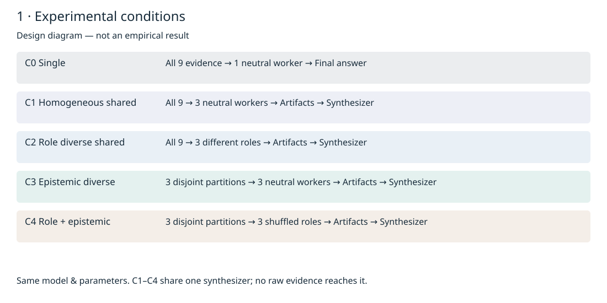
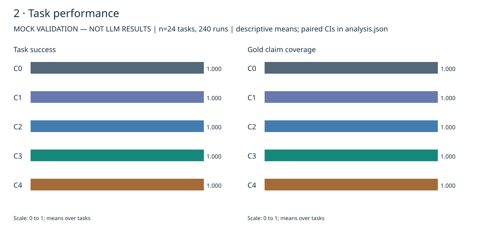

# Historical v1 README

This is an archived record. Its commands are superseded by the [current README](../../README.md); real main is now disabled. Links below were adjusted for the archive location.

# Role Diversity vs. Epistemic Diversity

How does epistemic diversity created by information separation compare with
prompt-level role diversity in LLM multi-agent systems?

**Status: experiment infrastructure validated with a deterministic MockProvider;
real-model experiment pending (no credentials available). No LLM superiority claim.**

This is an independent research application importing the existing `app/` runtime.
It changes neither runtime behavior nor its production dependencies. Its focus is
information access, not more agent names, personalities, or unrestricted debate.

## Design

| Condition | Workers | Roles | Raw evidence | Final stage |
|---|---:|---|---|---|
| C0 | 1 | neutral | full | worker returns final schema |
| C1 | 3 | identical neutral | full | common synthesizer |
| C2 | 3 | analytical / skeptical / systems | full | same synthesizer |
| C3 | 3 | identical neutral | disjoint | same synthesizer |
| C4 | 3 | three roles, shuffled across partitions | disjoint | same synthesizer |



All workers share one base model, parameters, schema, tool permissions (none),
per-call output budget and stopping rules. The synthesizer receives published
typed artifacts, **never raw worker documents**. Policies enforce this in Python;
prompts do not grant authority. C1–C4 form a 2×2 manipulation; C0 is an additional
single-agent baseline, not a compute-matched baseline.

The frozen [research plan](../../docs/research-plan.md) defines RQ1–RQ5, H1–H5, endpoints,
five paired comparisons and analysis before experiment execution. The
[methodology](../../docs/methodology.md) specifies formulas and boundary audits.

## Five-minute offline reproduction

Run from the repository root. Python 3.12+ and the root development environment
are sufficient; no new dependency, API key, Docker or vector database is needed.

```bash
uv sync --group dev
uv run python experiments/epistemic-diversity/run.py benchmark
uv run python experiments/epistemic-diversity/run.py plan --phase pilot
uv run python experiments/epistemic-diversity/run.py run \
  --provider mock --phase pilot \
  --campaign experiments/epistemic-diversity/runs/my-mock --max-model-calls 1000
uv run python experiments/epistemic-diversity/run.py run \
  --provider mock --phase full --repetitions 2 \
  --campaign experiments/epistemic-diversity/runs/my-mock --max-model-calls 1000
uv run python experiments/epistemic-diversity/run.py analyze \
  experiments/epistemic-diversity/runs/my-mock/full/results.json \
  --output experiments/epistemic-diversity/results/my-mock
uv run python experiments/epistemic-diversity/run.py figures \
  experiments/epistemic-diversity/results/my-mock/analysis.json \
  --output experiments/epistemic-diversity/figures/my-mock
```

An existing phase is never overwritten: use a new campaign name to rerun. The
1000-call override is for this **offline mock** validation (850 calls including
pilot), not the default real-model budget. Full contains pilot tasks too; pilot
and full are reported separately, not pooled as independent observations.

Already have `.venv` installed? Replace `uv run python` with `.venv/bin/python`.
These entrypoint commands were exercised locally with that interpreter.

### Inputs and outputs

`benchmark` deterministically materializes 24 task definitions from authored
specifications: 12 evidence-synthesis and 12 multi-perspective cases. There are
six templates, each with four truth configurations. `public/` contains task,
candidate rules and nine documents; `gold/` separately contains the true claims,
support sets, expected conclusion and annotation canary. The model never receives
the gold files. Oracle-balanced partitions assign two relevant and one distractor
document to each worker.

`run` feeds those public inputs through the existing DAG orchestrator. Workers
return `claims`, `insights`, citations and `uncertainty`; the final stage adds
`conclusion` and `decision_summary`. Console output is structured progress JSON.
Local campaign files include:

- `budget.sqlite`: atomic persistent call reservations, including failed calls.
- `<phase>/runtime.sqlite`: runs, events, snapshots, messages and artifacts.
- `<phase>/manifest.json`: source hashes, settings, prompts, seed and planned scope.
- `<phase>/records/<run_id>.json`: output, metrics, assignments, errors and diagnostics.
- `<phase>/traces/<run_id>.json`: actual model requests/responses plus the runtime trace.
- `<phase>/results.json`: executed records and final campaign metadata.

`analyze` produces task-level mean/median/SD/IQR, paired differences, bootstrap
intervals, paired permutation tests, Holm corrections, exact McNemar tests and
discordant failure-case records. `figures` makes five editable SVGs using only
observed data. See [field definitions](../../docs/methodology.md).

Raw traces are synthetic but verbose and stay gitignored locally. Compact
[full records](../../results/mock-full/records.json), [analysis](../../results/mock-full/analysis.json)
and [CSV](../../results/mock-full/metrics.csv) are included for independent reanalysis.
Trace paths inside records refer to the originating local campaign; regenerating
a campaign creates new UUIDs/timestamps. It does not promise byte-identical traces
or deterministic real-provider responses.

## Observed validation, not scientific findings

Executed offline: pilot **10 runs / 34 calls**; full **240 runs / 816 calls**.
Full has 24 tasks × five conditions × two repetitions. All final semantic scores
were perfect and all boundary audit counts were zero. Shared workers overlapped;
isolated workers contributed disjoint evidence. The mock deliberately ignores
role instructions and solves the public rules, so these are **pipeline checks,
not evidence for or against any LLM hypothesis**.

[Findings](../../docs/findings.md) · [Generated summary](../../results/mock-full/summary.md) ·
[日本語解説](../../docs/summary_ja.md) · [Limitations](../../docs/limitations.md)



## Real-model pilot and main (not executed here)

Export `OPENAI_API_KEY` securely into the process environment. The experiment does
not automatically read `.env` and never records the key. `MODEL_BASE_URL` may
point to an authorized Chat Completions-compatible endpoint supporting structured
JSON output, temperature and `max_completion_tokens`. Select an actual supported
model yourself; no paid-model name or price is guessed here.

```bash
# After securely setting OPENAI_API_KEY and choosing MODEL_NAME:
export MAX_MODEL_CALLS=180
uv run python experiments/epistemic-diversity/run.py run \
  --provider real --model "$MODEL_NAME" --phase pilot \
  --campaign experiments/epistemic-diversity/runs/real-study
uv run python experiments/epistemic-diversity/run.py run \
  --provider real --model "$MODEL_NAME" --phase main --repetitions 2 \
  --campaign experiments/epistemic-diversity/runs/real-study
```

Pilot: 2 tasks × 5 conditions = 10 runs / 34 calls. Main: disjoint 4 tasks × 5
conditions × 2 repetitions = 40 runs / 136 calls. Total **170 calls ≤ 180**.
Main requires a complete safe pilot with matching source/prompt/model fingerprint.
Semantic mistakes do not disqualify a pilot; runtime/schema/boundary errors do.
If budget is smaller, the planner retains whole five-condition blocks and reports
unexecuted blocks. Caps apply per campaign; choosing a new campaign starts a new
ledger. Calls from failed attempts are not refunded. Cost remains `null`: this
version has no verified pricing feed. Analyze real runs into a separate results
directory; never merge them with mock records.

## Validation commands

```bash
uv run ruff format --check .
uv run ruff check .
uv run mypy
MYPYPATH=experiments/epistemic-diversity/src uv run mypy --strict \
  experiments/epistemic-diversity/src experiments/epistemic-diversity/run.py
uv run pytest -q tests
uv run pytest -q experiments/epistemic-diversity/tests
```

## Research boundaries

Information separation changes accessible external evidence, not model weights or
intrinsic beliefs. Evidence uniqueness is partly forced by disjoint assignments;
it cannot establish creativity. Public symbolic rules, repeated templates and
balanced partitions are deliberate controls with limited realism. There is no
LLM judge, semantic embedding metric, adversarial benchmark, world model, new UI
or ablation in this iteration. No runtime code changes were necessary.

[Research log](../../docs/experiment-log.md) · [Verified related work](../../docs/related-work.md) ·
[Paper outline](../../paper/outline.md) · [Status](../../STATUS.md)
