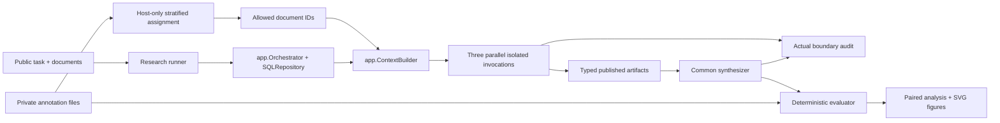

# Methodology — v2 amendments and retained v1 record

Current execution protocol is pilot-2.1. Public rule and candidate order is
randomized identically across all conditions for each task/seed, without gold.
The benchmark's canonical stored order is not the provider-facing order. This
corrects an author-order shortcut; see protocol-2.1-amendment.md. Old protocol-2
mock records are preserved and must not be pooled with the amended cohort.

Current benchmark 2.0.0 and metrics 2.0.0 are specified in
[benchmark-taxonomy.md](benchmark-taxonomy.md), [metric-audit.md](metric-audit.md)
and [experiment-freeze.md](experiment-freeze.md). They override the numerical
v1 setup below, which remains a historical record rather than current instructions.

V2 has 30 authored cases from ten structural families, exact canonical outputs,
source-attributed contradictions, explicit unknowns, multi-stage inference and
ordered action decisions. Public candidate rules are shared across conditions;
gold facts/insights, importance strata and expected answers are evaluator-only.
Support witnesses and final decisions are authored, checked with independent
Boolean closure; alternative support sets are enumerated by a public proof engine.
Depth metadata is checked from active rule paths, not guessed from text length.

The partition search uses only relevance/importance/support annotations, not model
outcomes. Count imbalance is at most one per stratum, decision-support concentration
at most 2/3, audited importance range at most three integer points. Role mapping
uses an independent task/seed shuffle. This still uses oracle routing.

V2 metric changes: separate required facts/insights from optional statements; retain
observed worker coverage despite a later synthesis failure; check explicit final
unknowns; add useful collective gain and fixed-output provenance-removal support
loss. No extra model calls are hidden in marginal contribution. See metric-audit
for exact denominators and the distinction from actual counterfactual regeneration.

Pilot is six preselected cases from six families, C2/C3, 48 calls. Average paired
task/repetition differences within family, then bootstrap/sign-flip family means.
Report both task count and resampling-unit count; never pool benchmark/model/
protocol versions. Model selection is fixed in a separate immutable pre-call
binding because credentials/model choice were unavailable during content freeze.
Budget reservations and raw structured-response audit precede/cover failures;
real main/full are disabled. Human-readable reports include all attempted outputs
and gold on the evaluator side only. No judge, hidden reasoning or model conclusions.

## Historical v1 methodology

This document explains the frozen [plan](research-plan.md), not a post-hoc change
to its endpoints. All current numerical files are mock validation only.

## Dependency and authority boundary

`conditions.py` accepts only `PublicTask`, selected IDs, condition and settings.
Its policy objects declare document visibility and allowed artifact producers.
It never loads annotations. The host-only assignment code uses relevance strata
to balance partitions; this is oracle routing, disclosed rather than hidden.
`app/` imports no research module. There are no experiment-specific runtime
branches. Both demos and the new experiment use the same generic runtime.

Worker context contains task, public reporting fields/alternative decision rules,
and its allowed knowledge documents. It contains no other artifacts or memory.
Synthesizer context contains the same task/rules plus ACL-approved publications,
not source documents. No tools are registered; all access remains deny-by-default.
Context objects are detached copies, not references to authoritative state.
Publishing evidence references is explicit declassification; no worker-to-worker
communications or unbounded conversations occur.

## Benchmark construction

The dataset is authored without LLM calls. `specifications.json` contains six
domain contexts: release incident, delivery disruption, quality audit, service
architecture, resource planning and data governance. Each specifies six binary
observations, two intermediate insights and four candidate decisions. Each insight
requires three observations, so an isolated worker's two relevant observations
are insufficient alone. All evidence together suffices.

Each template contributes four variants of the two three-observation groups.
Values **within a group co-vary**; this intentionally small truth table omits
mixed-premise cases. Consequently the six templates are a more honest measure of
scenario breadth than the 24 file count. B's planning/architecture problems
require combining constraints, but their logical mechanics resemble A; they are
not independent evidence of broad reasoning generality.

Public rules enumerate all candidate yes/no insights and all four decisions.
They do not specify which candidate is true. True values, relevant IDs, complete
support sets and expected conclusions reside only in separate gold files. IDs
and source canaries are opaque hashes. Task IDs, family labels and gold annotations
are not placed in agent inputs. Content is marked `untrusted_data` by the runtime.

Each partition receives two of six relevant documents and one of three explicitly
archival distractors. A seeded shuffle randomizes membership and ordering. The
same task/repetition seed generates the same partitions across conditions and the
same role permutation for C2/C4. Condition order is independently shuffled within
each block. Seeds do not control provider sampling; no unsupported determinism is
claimed for an external LLM.

## Model and output controls

One provider/model, temperature 0, maximum 2048 output tokens per call, timeout 90s,
one attempt and one model turn by default. C1/C3 have identical neutral worker
instructions. C2/C4 append the same three brief perspective priorities, shuffled
across worker IDs. C1–C4 have identical synthesis instructions and final schema.
C0 necessarily combines extraction and finalization in one prompt but shares the
final schema. Worker IDs are distinct routing metadata even in C1.

`Claim` = canonical subject/value plus evidence IDs. `WorkerOutput` adds claims,
insights and uncertainty. `FinalOutput` additionally specifies conclusion and a
concise decision summary. No hidden chain-of-thought is requested or persisted.
Strict model schemas reject extra fields; runtime citation validation rejects
unknown evidence references independently of prompting.

## Deterministic scoring

Let V_i be worker i's set of **valid** canonical claims/insights and E_i their
cited evidence IDs. Validity requires a normalized subject/value gold match and a
citation set exactly matching one complete annotated supporting set. Invented,
incomplete or extra citations do not earn credit. Duplicate statements do not
inflate set coverage. Supported-but-unannotated claims count as unsupported under
this strict closed-world evaluator, which is a limitation.

| Metric | Definition |
|---|---|
| Task success | Runtime succeeds, correct final decision, all required claims/insights valid, no unsupported final claims or conflicting final values |
| Gold claim coverage | Valid final gold fact keys / required gold fact keys |
| Required insight coverage | Valid final required insight keys / required insight keys |
| Worker evidence coverage | Relevant IDs in union(E_i) / all gold relevant IDs |
| Final evidence coverage | Relevant IDs in valid final statements / all relevant IDs |
| Unique contribution | Union items held by exactly one worker / union items |
| Redundancy | (Sum of individual set sizes − union size) / sum of sizes |
| Pairwise Jaccard | Mean intersection/union over nonempty pair unions |
| Worker distinct insights | Number of valid required insight keys in union(V_i) |
| Contradictions | Subjects assigned more than one normalized value, workers and final separately |
| Unsupported claims | Statement occurrences without exact gold and complete citation support |

Diversity is computed separately for evidence sets and canonical claim/insight
sets. C0 has null peer-diversity values. All-empty groups give zero uniqueness
and redundancy, null Jaccard. Failed runtime attempts retain errors/usage and zero
quality endpoints; observed worker artifacts still appear in diagnostics. No
failed attempt is filtered for having an unfavorable answer.

### Leakage versus visibility

Audit actual `ModelRequest`s and returned `ModelResponse`s, including structured
responses later rejected by the executor. Allowed IDs are derived from configured
policies and authorized publications, **not** from the request being audited.
Count unauthorized known evidence IDs and source-canary occurrences per call
boundary. Count hidden annotation markers/keys independently. These are detection
hits, not a guarantee against paraphrased semantic leakage or guessed values.
An invalid non-JSON HTTP body may be rejected inside the existing provider adapter
before a typed response is available; the safe error is retained, not its body.

Shared workers are authorized to see all documents. They can have zero ACL
violations while accessing six documents outside their hypothetical isolated
partition. `raw_exposure_outside_partition` counts those extra raw document
exposures across workers (18 for shared, 0 for isolated). It is structural exposure,
**not information leakage**. C0 has no three-worker exposure comparison (null).

### Resource metrics

Calls count actual audited dispatch attempts. The persistent SQLite ledger reserves
before each call, atomically across processes, and does not refund failures.
Input/output tokens come from provider usage. Mock substitutes character-count/4
estimates. Failed transports can lack usage, so real totals may be lower bounds.
Latency measures wall time including scheduling/checkpoints. Three workers can
overlap, followed by one synthesis call. All costs are null because there is no
verified price source configured; a missing price is not zero dollars.

## Analysis

P1 = C3−C2; P2 = C2−C1; P3 = C3−C1; P4 = C4−C3; P5 = C3−C0.
Co-primary endpoints are final gold-claim coverage and worker relevant-evidence
coverage. Repetitions are averaged **within task**. Paired differences use only
matched task/repetition pairs; missing blocks are explicitly listed. Descriptives
report mean, median, sample SD and interpolated IQR over task averages.

Inference uses 5000 seeded task-level bootstrap draws for percentile 95% intervals.
Effect size dz divides the mean paired difference by the sample SD of differences;
it is null if variance is zero. Exact two-sided paired sign flips apply at n≤16;
otherwise 20,000 seeded sign flips with a +1 Monte Carlo correction. Holm adjustment
covers the ten co-primary tests. Exact McNemar on repetition zero tests binary
success secondarily; five comparisons have a separate Holm adjustment.

There is no template-cluster correction in v1. Task resampling ignores dependence
between the four variants of each template; intervals must not be treated as
population-wide evidence. No inferential claim is drawn from mock tests at all.
Before a real paper, diversify templates or preregister cluster-level sensitivity
analysis in a new protocol version rather than silently changing this one.

## Saved provenance and failure review

Each executed record has ID/time, commit and dirty/source hash, condition/task,
seed/repetition, model settings, role/partition maps, prompt version, benchmark
hash, final output, metrics, usage semantics, errors and diagnostic missing keys.
The manifest stores full prompts and per-file hashes. Full synthetic requests,
responses, events and policies remain in the local trace directory. Source hashes
include the research sources/configs/prompts/dataset and runtime `app` files.
The parent commit alone does not identify uncommitted research additions; use the
file fingerprints or commit the final reviewed branch before paid execution.

Failure analysis searches every observed C2/C3 pair for either direction of
discordant success. Existing cases include both records, assignments, missing
claims/insights and trace links. If no pair exists, it says so rather than
inventing a demonstration. Infrastructure interruptions can leave incomplete
blocks; inspect the durable runtime snapshots and preserve them before recovery.
